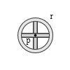
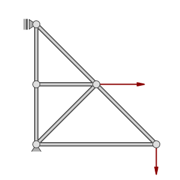
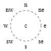
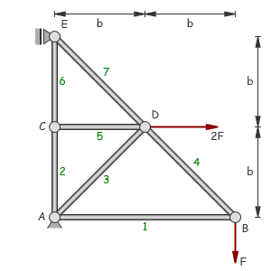

[](https://github.com/goessner/g2/license.txt)
[](https://www.npmjs.com/package/g2d-mec)

# g2.mec.js #

## g2 extension for mechanical applications ##

### Mechanical Symbols ###

`g2.mec.js` provides some useful mechanical symbols for the [`g2.js`](https://github.com/goessner/g2) graphics library.


Using these symbols is easily done with the help of the `use` command. While they are available 
through the `g2.symbol` namespace, the bare symbol name is sufficient as the first parameter.
We can translate, rotate and scale the symbols as expected. Please note, that their line width is mostly immune 
against scaling.

```javascript
    g = g2().use(g2.symbol.origin,{x:100,y:50});
    // or alternatively ...
    g = g2().use("origin",{x:100,y:50});
```

### Mechanical Elements ###

`g2.mec.js` also provides some mechanical elements.


Element functions have individual arguments.

Element | Image | Meaning
-------- | -------- | ------
`vec(p,r,style)` |  | Linear vector element by start point `p` and end point or direction `r`.
`avec(p,r,w,dw,style)` |  |  Arc vector element by center point `p`, radius `r`, start angle `w` and angular range `dw`. 
`dim(p,r,args)` |  |  Linear dimension element by start point `p` and end point or direction `r`.
`adim(p,r,w,dw,args)` |  |   Arc dimension element by center point `p`, radius `r`, start angle `w` and angular range `dw`.
`slider(p,w,args)` |  |  Slider element by center point `p` and rotation angle `w`.
`spring(p,r,args)` |  |  Symbolical Spring element by start point `p` and end point or direction `r`.
`damper(p,r,args)` |  |  Symbolical Damper element by start point `p` and end point or direction `r`.
`ground(pts,closed,args)` |  |  Polygonial ground element by points array `pts` and closed flag `closed`.
`bar(p,r)` |  |  Bar element by start point `p` and end point or direction `r`.
`bar2(p,r)` |  |  Alternate Bar2 element by start point `p` and end point or direction `r`.
`link(pts,closed)` |  |  Link element by points array `pts` and closed flag [`true,false`].
`link2(pts,closed)` |  |  Alternate Link2 element by points array `pts` and closed flag [`true,false`].
`beam(pts)` |  |  Beam element by points array `pts`.
`beam2(pts)` |  |  Alternate Beam2 element by points array `pts`.
`load(pts,spacing,style)` |  |  Load element by points array `pts` and spacing `spacing` between arrows.
`pulley(p,r)` |  |  Pulley element by center point `p` and radius `r`.
`pulley2(p,r)` |  |  Pulley2 element by position `pos={x,y,w}` including rotation angle `w` and radius `r`.
`rope(p1,r1,p2,r2)` |  |  Rope element tangential to two circles with given center points `p1` and `p2` and radii `r1` and `r2`. You can switch between the four possible tangents by the sign of the radii.


### Mechanical Styles

There are some predefined colors, line styles and other constants. 
You can overwrite them, if you are not comfortable with it.

| Name | Type | Default | Description |
| --- | --- | --- | --- |
| State | <code>object</code> |  | `g2` state namespace. |
| State.nodcolor | <code>string</code> | <code>&quot;#333&quot;</code> | node color. |
| State.nodfill | <code>string</code> | <code>&quot;#dedede&quot;</code> | node fill color. |
| State.nodfill2 | <code>string</code> | <code>&quot;#aeaeae&quot;</code> | alternate node fill color, somewhat darker. |
| State.linkcolor | <code>string</code> | <code>&quot;#666&quot;</code> | link color. |
| State.linkfill | <code>string</code> | <code>&quot;rgba(200,200,200,0.5)&quot;</code> | link fill color, semi-transparent. |
| State.solid | <code>array</code> | <code>[]</code> | solid line style. |
| State.dash | <code>array</code> | <code>[15,10]</code> | dashed line style. |
| State.dot | <code>array</code> | <code>[4,4]</code> | dotted line style. |
| State.dashdot | <code>array</code> | <code>[25,6.5,2,6.5]</code> | dashdotted line style. |
| State.labelOffset | <code>number</code> | <code>5</code> | default label offset distance. |
| State.labelSignificantDigits | <code>number</code> | <code>3</code> | default label's significant digits after floating point. |


### Truss Example

You can see a simple truss below, composed from mechanical symbols and elements.



```js
// g2.mec truss example ...
    var A = {x:50,y:50},  B = {x:250,y:50},
        C = {x:50,y:150}, D = {x:150,y:150},
        E = {x:50,y:250},
        g = g2()
             .cartesian()
             .link2([A,B,E,A,D,C])
             .vec(B,{dx:0,dy:-50},{lw:2,ls:"darkred"})
             .vec(D,{dx:80,dy:0},{lw:2,ls:"darkred"})
             .use("nodfix",A)
             .use("nod",B)
             .use("nod",C)
             .use("nod",D)
             .use("nodflt",{x:E.x,y:E.y,w:-Math.PI/2})
             .exe(document.getElementById("c").getContext("2d"));
```

### Labels

If you want to add text to a geometric element, you can always use the basic `txt` element. However some 
element types support the smarter `label` element, which comes with a more intuitive relative positioning with respect 
to its nearest previous element. Reliable positioning requires always *cartesian* coordinates.  

Element | Meaning
:--------: | :--------:
`label(str,loc,off)` | Label element placing string `str` at location `loc` using offset `off`.

Point like and rectangular elements provide locations according cardinal directions. Linear elements provide parameterized numerical
or named locations.

| Type  | Elements | default | locations | offset | img |
| :-----: | :------: | :-----: | :-----: | :-----: | :-----: |
| Point elements | `cir, use` | `c` |`c`<br>`e,ne,n,nw,w,sw,s,se`<br>angle in [radians] | number |  |
| Rectangular elements | `rec, slider` | `c` |`c`<br>`e,ne,n,nw,w,sw,s,se` | number |  |
| Linear elements | `lin, vec, dim`<br>`arc, avec, adim`<br>`spring, damper`<br> `bar, bar2`| `0.5` | `beg, mid, end`<br> normalized numerical parameter | `left, right`<br>number | 
| Polygonial elements | `ply, ground`<br>`link, link2` | `0.5` | `beg, end`<br> `#index` <br> normalized numerical parameter | `left, right`<br>number | 
| Spline element | `spline` | `beg` | `beg, end`<br> `#index` | `left, right`<br>number | 

If there is no offset distance specified, the global `g2.State.labelOffset`'s value is taken. Please note,
that cardinal locations are not sensitive to transformations.


### Truss Example with Labels

The truss example above can now be improved by adding labels.



```javascript
  // g2.mec truss example with labels ...
     var A = {x:50,y:50},  B = {x:250,y:50},
         C = {x:50,y:150}, D = {x:150,y:150},
         E = {x:50,y:250},
         g = g2()
              .cartesian()
              .style({foz:12,fof:"cursive",foc:"green"})
              .bar2(A,B).label("1")
              .bar2(A,C).label("2")
              .bar2(A,D).label("3")
              .bar2(B,D).label("4")
              .bar2(C,D).label("5")
              .bar2(C,E).label("6")
              .bar2(D,E).label("7")
              .style({foc:"@nodcolor"})
              .vec(B,{dx:0,dy:-50},{lw:2,ls:"brown"}).label("F","end","left")
              .vec(D,{dx:80,dy:0},{lw:2,ls:"brown"}).label("2F","end")
              .use("nodfix",A).label("A","w")
              .use("nod",B).label("B","se")
              .use("nod",C).label("C","w")
              .use("nod",D).label("D","ne")
              .use("nodflt",{x:E.x,y:E.y,w:-Math.PI/2}).label("E","e")
              .style({ls:"@dimcolor",foc:"@ls"})
              .dim({x:A.x,y:275},{dx:100,dy:0}).label("b")
              .dim({x:D.x,y:275},{dx:100,dy:0}).label("b")
              .dim({x:275,y:E.y},{dx:0,dy:-100}).label("b")
              .dim({x:275,y:D.y},{dx:0,dy:-100}).label("b")
              .exe(document.getElementById("c").getContext("2d"));
```

### Markers

Markers can be placed onto the outline of the nearest previous element.

Element | Meaning
:--------: | :--------:
`mark(type,loc,dir)` | Marker element placing marker symbol `type` at locations `loc` regarding to direction `dir`.

Elements with a unique center and rectangular elements provide locations according cardinal directions.
Linear elements provide parameterized numerical or named locations. The `spline` element only support indexed locations. It does not support parameterized locations.

| Type  | Elements | default | locations |dir | img |
| :-----: | :------: | :-----: | :-----: | :-----: | :-----: |
| Centered elements | `cir` | `c` | `c`<br>`e,ne,n,nw,w,sw,s,se`<br>normalized parameter | `-1,0,1` |  |
| Rectangular elements | `rec, slider` | `c` | `c`<br>`e,ne,n,nw,w,sw,s,se` | `-1,0,1` |  |
| Linear elements | `lin, vec, dim`<br>`arc, avec, adim`<br>`spring, damper`<br> `bar, bar2`| `0.5` | `beg, mid, end`<br> normalized numerical parameter | `-1,0,1` | 
| Polygonial elements | `ply, ground`<br>`link, link2` | `0.5` | `beg, end, mid, all`<br> `#index` <br> normalized numerical parameter |`-1,0,1` | 
| Spline element | `spline` | `beg` | `beg, end, mid, all`<br> `#index` |`-1,0,1` | 

# API Reference
See the [API Reference](api/readme.md) for details.

## Tests

See this growing table of [test cases](https://goessner.github.io/g2-mec/test/index.html) with canvas and svg output side by side.


## GitCDN
Use the link [https://gitcdn.xyz/repo/goessner/g2-mec/master/g2.mec.min.js](https://gitcdn.xyz/repo/goessner/g2/master/g2.min.js)
for getting the latest commit as a raw file.

In HTML use ...
```html
<script src="https://gitcdn.xyz/repo/goessner/g2-mec/master/g2.mec.min.js"></script>
```


# License
`g2.mec` is licensed under the terms of the MIT License.


#Change Log

## 0.4.5 - 2016-08-01
### Modified

* Use of `mark` and `label` element requires `cartesian` flag set from now on.
* `use` command execution simplified.
* styling bug with `g2.prototype.use` removed. 

## 0.4.4 - 2016-06-21
### Added

* `g2.spline` performing 'centripetal Catmull-Rom' interpolation.

### Modified

* modified `g2.prototype.ply.iterator` integrated.


## 0.4.0 - 2016-05-24

### Added

  `link, bar, pulley, rope` elements added.

## 0.3.0 - 2016-05-13

### Changed

*    Fundamental changes also affecting the api.
*    See documentation and API for details. @goessner.

    
## 0.2.3 - 2016-05-03

### Changed

    Transformation bug removed @goessner.

## 0.2.0 - 2016-01-10

### Added

    CHANGELOG.md @goessner.
